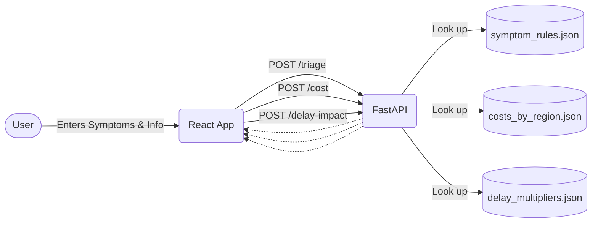

# HealthCost AI — Smart Care & Cost Navigator

HealthCost AI is a web application that helps users navigate health care options based on their symptoms. It provides an assessment of urgency (e.g., self-care, clinic visit, emergency room), estimated care costs based on regional tiers, and the financial impact of delaying care for chronic conditions.

> **Note**: The data in this application (costs, symptom rules, and delay impact multipliers) is illustrative sample data for MVP demo purposes. This tool gives general guidance, not a medical diagnosis.

## Architecture

- **Backend**: Python, FastAPI, Pydantic (Local JSON stores for data)
- **Frontend**: React, Vite, Plain CSS




## How to Run Locally

### Backend Setup

1. Open a terminal and navigate to the `backend` folder.
2. Ensure you have Python installed. Activate your virtual environment if you have one.
3. Install dependencies:
   ```bash
   pip install -r requirements.txt
   ```
4. Run the FastAPI server:
   ```bash
   uvicorn main:app --reload
   ```
   The backend will be available at `http://localhost:8080`. You can test the endpoints at `http://localhost:8080/docs`.

### Frontend Setup

1. Open a new terminal and navigate to the `frontend` folder.
2. Ensure you have Node.js installed.
3. Install dependencies:
   ```bash
   npm install
   ```
4. Start the development server:
   ```bash
   npm run dev
   ```
   The frontend will be available at `http://localhost:5173`.

## Demo Steps

1. Open the frontend in your browser.
2. You will see a clean, accessible interface with a non-dismissible medical disclaimer.
3. **Emergency Flow**: Enter "chest pain" in the symptoms, age 50, duration 1. Select "Urban". Submit to see the ER urgency level and high cost estimates.
4. **Clinic & Chronic Flow**: Enter "cough" in symptoms, age 45, duration 14. Select "Diabetes" as a chronic condition. Submit to see the Clinic urgency level, cost estimates, and the comparison showing how delaying treatment for diabetes increases costs.

   ## Live Demo
- **Frontend (Vercel)**: [https://frontend-roan-delta-44.vercel.app](https://frontend-roan-delta-44.vercel.app)
- **Backend API (Railway)**: [https://healthcost-ai-production.up.railway.app](https://healthcost-ai-production.up.railway.app)

   https://github.com/user-attachments/assets/abac9d32-49f6-4519-8acc-5474c7b2cf67

   Watch full demo on YouTube:https://youtu.be/xT_6S1QmuHw
